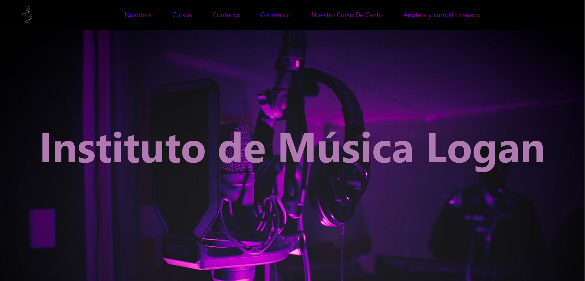
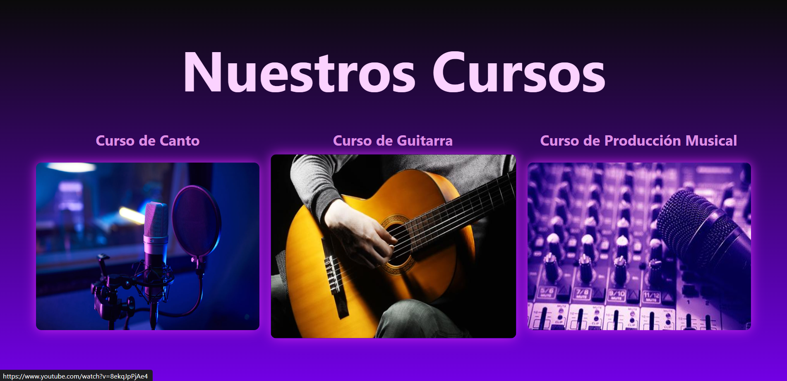

# 🎹 Instituto Musical - Landing Page

Una interfaz web profesional diseñada para una academia de música, con foco en la presentación de cursos, categorías de instrumentos y un flujo visual atractivo para potenciales estudiantes.

---

## 🚀 Demo en Vivo
Puedes ver el proyecto funcionando en tiempo real a través de Netlify:
[Visitar Sitio de Sinfonía Virtual](https://music-instituto-landing.netlify.app/)

## 🛠️ Tecnologías Utilizadas
* **HTML5:** Estructura semántica para una mejor accesibilidad y posicionamiento.
* **CSS3:** Estilizado personalizado utilizando **Flexbox** y **CSS Grid** para lograr un diseño de grilla moderno y organizado.
* **Diseño Responsivo:** Adaptación completa para que el sitio se vea impecable en celulares, tablets y computadoras.
* **JavaScript:** Implementación de lógica para la interactividad y navegación dinámica del sitio.

## ✨ Características Principales
* **Catálogo de Cursos:** Visualización clara de las distintas clases de instrumentos y teoría musical.
* **Estética Moderna:** Interfaz con temática "Dark Mode" diseñada específicamente para un entorno artístico.
* **Navegación Intuitiva:** Secciones organizadas para facilitar la experiencia del usuario (UX).
* **Componentes Interactivos:** Efectos de *hover* y transiciones suaves que mejoran la dinámica visual.

## 📸 Capturas de Pantalla

### Vista Principal (Home)

### Secciones y Cursos

---

## 🏗️ Contexto del Proyecto
Este desarrollo forma parte de mis proyectos académicos en la **Tecnicatura Universitaria en Programación (UNAHUR)**. El objetivo principal fue dominar la maquetación avanzada con CSS y asegurar un flujo de trabajo profesional utilizando herramientas de despliegue continuo (CI/CD).

---
Desarrollado por [Logan Casals](https://github.com/logancasals-9)
